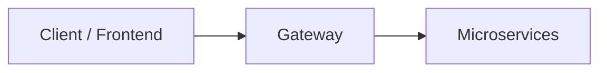

# KadITSM

A Jira-like project and ticket management system, built as a solo, hands-on learning project.

## Overview

KadITSM is a large-scale project and issue tracking platform, similar in spirit to Jira: teams can manage projects, issues, sprints, workflows, permissions, notifications, and more. It is built as a polyglot microservices system, with each service intentionally implemented using a different language, framework, and architectural pattern.

## Why I Built This

I chose this project because it naturally requires a large number of modules and moving parts, which made it a good vehicle for learning a wide range of backend engineering topics at once, rather than in isolation. Specifically, I wanted to get hands-on experience with:

- Polyglot microservice architectures
- Different code/application architecture patterns (Hexagonal, Clean, Layered, Event-driven, CQRS, State Pattern, Rule Engine Pattern)
- End-to-end CI/CD pipeline management
- Working with relational databases, document databases, Redis, and message queues in real service-to-service scenarios
- Server and container management
- Separating and managing dev/prod environments
- Project management on GitHub using Scrum/Kanban workflows

## What This Is / What This Is Not

This is purely a learning project, not a commercial product. That said, the goal is to work through realistic, production-style scenarios rather than toy examples, in order to get a genuine feel for how these systems are architected and operated in the industry. Decisions, service boundaries, and technology choices are expected to evolve as the project progresses and as new things are learned.

## Backend Architecture Overview
 
The system is composed of independent microservices communicating over REST, gRPC, and asynchronous messaging (RabbitMQ/Kafka), each owning its own data store. Services are intentionally implemented in different languages and with different architectural styles, so that the same kinds of problems (authentication, data consistency, event handling, etc.) can be explored through multiple approaches.
 

 
Each service's internal architecture, tech stack, and implementation details live in its own directory under `api/v1/<service-name>`.

## Services & Tech Stack

| Service | Language / Framework | Architecture | Data / Messaging |
|---|---|---|---|
| Gateway | Go | Routing layer | Redis, RabbitMQ (subscribe) |
| Auth Service | Java (Spring Boot) | Hexagonal Architecture | PostgreSQL, Redis, RabbitMQ (publish) |
| User Service | .NET Core | Layered Architecture | PostgreSQL |
| Project Service | Spring Boot | Layered Architecture | PostgreSQL |
| Issue Service | Spring Boot | Clean Architecture | PostgreSQL |
| Workflow Service | Go | State Pattern | PostgreSQL, Kafka/RabbitMQ (consumer) |
| Sprint Service | Go | Hexagonal Architecture | PostgreSQL, REST/gRPC |
| Notification Service | Node.js (NestJS) | Event-driven Architecture | MongoDB, Kafka/RabbitMQ (consumer) |
| Analytics Service | Python (FastAPI) | CQRS | MongoDB, REST |
| Search Service | Go | Hexagonal Architecture | Elasticsearch, gRPC |
| Permission Service | .NET Core | Hexagonal Architecture | PostgreSQL, Redis |
| Automation Service | Node.js (NestJS) | Rule Engine Pattern | MongoDB |
| File Service | .NET Core | Layered Architecture | PostgreSQL, S3 storage |

Gateway and Auth Service are currently deployed; the remaining services are in progress. This mapping is expected to change as the project evolves.

## Infrastructure & Deployment

The system runs on a self-hosted Proxmox homelab. A virtual machine on Proxmox runs Docker, and services are containerized with individual Dockerfiles and docker-compose configurations. Deployments are automated through self-hosted GitHub Actions runners, with one workflow per service (`.github/workflows/deploy-<service-name>.yml`) handling build and deployment to the homelab environment. Further infrastructure topics (such as orchestration beyond docker-compose) are still being explored.

## CI/CD Pipeline

CI/CD is currently managed entirely through GitHub Actions, using self-hosted runners for the full pipeline: building, testing, and deploying each service independently. Extending and refining this pipeline as the system grows is an ongoing part of the learning goals.

## Engineering Principles & Focus Areas

The current areas of focus are domain-driven design, overall system architecture, and CI/CD management. Beyond that, priorities shift as new topics come up during development — for example, secure token/session handling became a deep focus after working through it in the Auth Service. Code quality has been a consistent concern from the start of the project.

## Roadmap

The development roadmap and progress tracking are maintained on the [KadITSM Development Roadmap](https://github.com/users/kadadana/projects/1) GitHub Projects board.

## Repository Structure

This is a monorepo. Each service lives under `api/`.

## Status

KadITSM is an actively evolving, solo side project. Scope, architecture, and technology choices change frequently as new things are learned, so this README and the codebase may not always be in perfect sync.
