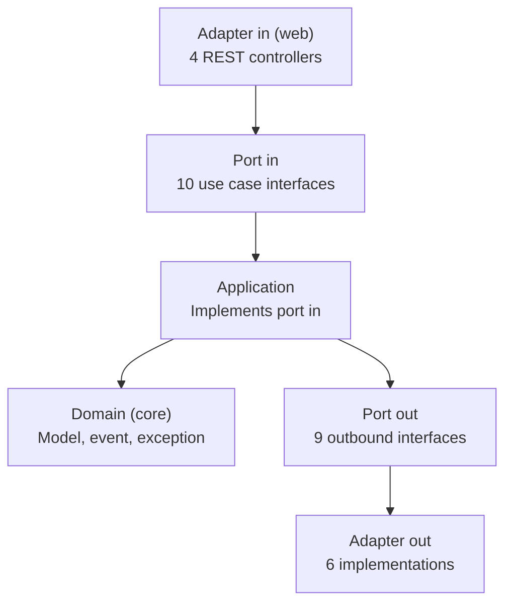
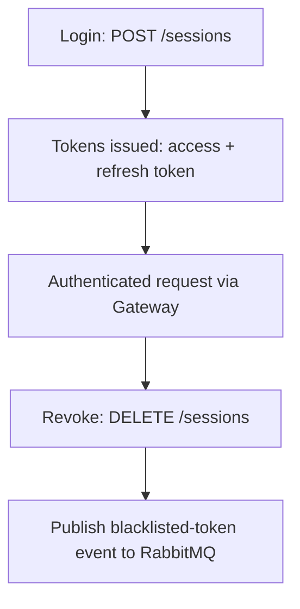

# Auth Service

Identity and authentication service for KadITSM.

## Overview

The Auth Service is responsible for identity and authentication management: issuing and validating JWTs, exposing a JWKS endpoint, and handling password resets.

## Responsibilities / Scope

This service manages identities, sessions, and tokens. It does not handle user profile management, which is owned by the User Service.

## Architecture

The service follows Hexagonal Architecture:

- `domain/` — domain models, domain events, and domain exceptions
- `application/port/in/` — inbound port interfaces (use cases)
- `application/service/` — implements the inbound ports, orchestrating the domain logic
- `application/port/out/` — outbound port interfaces
- `adapter/out/` — implements the outbound ports (persistence, messaging, etc.)
- `adapter/in/web/` — the API layer: controllers, DTOs, and mappers

## Domain Model

The core concept is an Identity: a login-capable account, distinct from a user profile and scoped purely to credentials and authentication. A Session is tracked via a refresh token and an access token; device information is not yet tracked, but is planned for a future iteration. Each Identity belongs to exactly one tenant.

## Multi-Tenancy

The service runs on a single shared database. Users can only see and manage the data belonging to their own tenant within that shared database.

## Tech Stack

- Java, Spring Boot
- PostgreSQL
- Redis
- RabbitMQ (publish)

## API

The service currently exposes RESTful endpoints across the following resource groups:

- Sessions
- JWKS
- Password reset
- Identity

Endpoints are designed to be RESTful rather than action-based — for example, `POST /sessions` and `DELETE /sessions` are used instead of dedicated login/logout endpoints.

## Events

The service publishes blacklisted-token events to RabbitMQ when a token is revoked. It does not consume any events itself.

## Token Lifecycle

## Local Setup / Running

- **Local development**: configured via a `.env` file and `application.properties`.
- **Production**: runs in Docker, using its own `Dockerfile` and `docker-compose` configuration. Deployment is automated through `.github/workflows/deploy-auth.yml`, using secrets and variables defined in a dedicated GitHub Actions environment. No values are hardcoded.

## Status

The service is largely feature-complete and currently receives only minor fixes.
